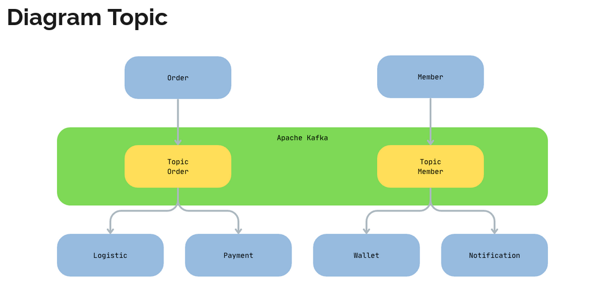
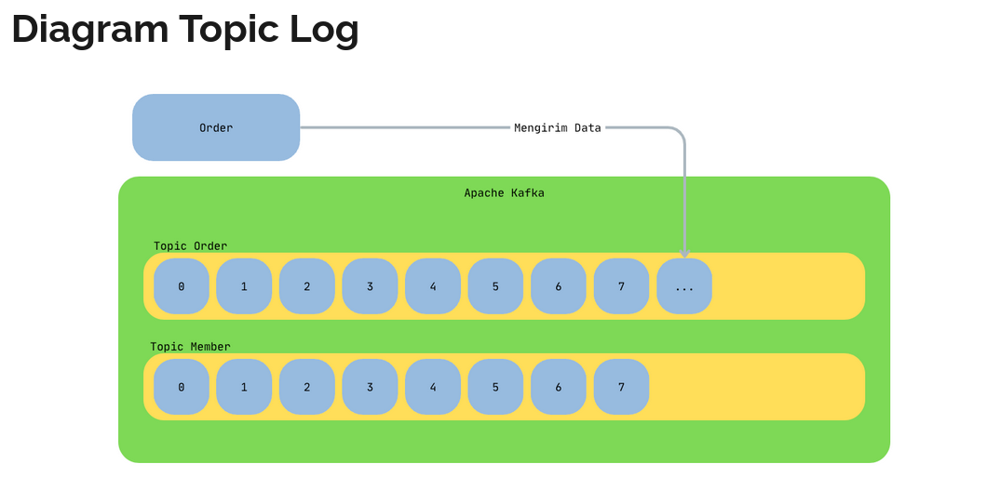
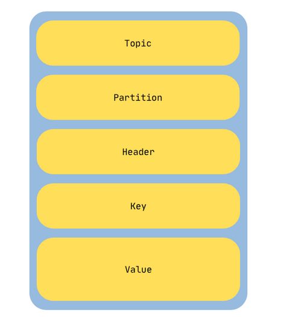
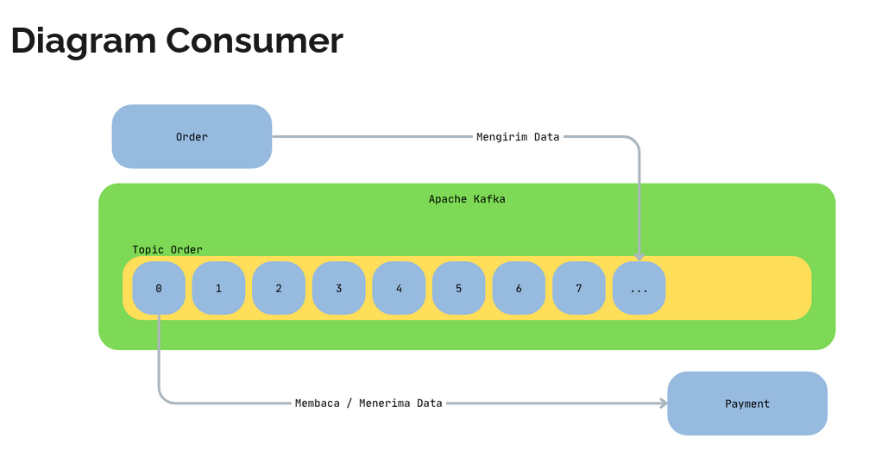
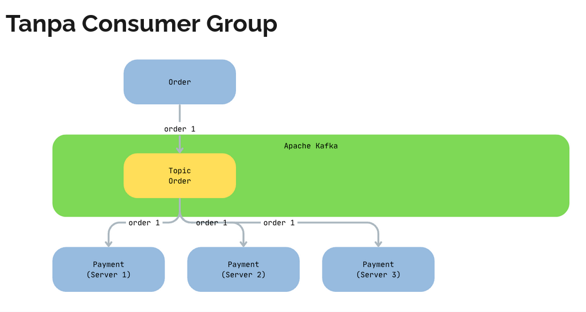
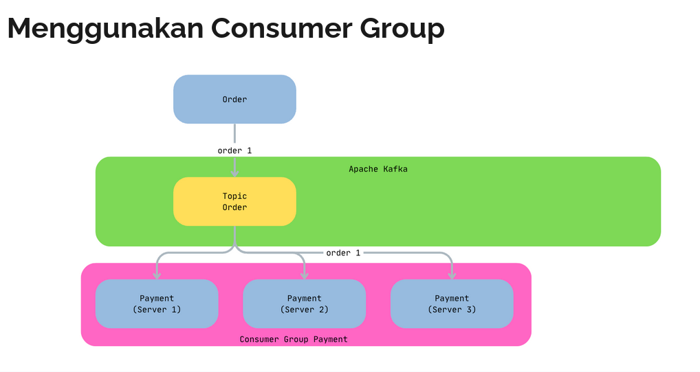

# Topic
- Saat kita mengirim data ke Kafka, kita harus mengirim data tersebut ke Topic 
- Topic itu mirip Table di Database, dimana digunakan untuk menyimpan data yang dikirim oleh pengirim data

# Diagram Topic

# Log
- Data di topic disimpan dalam format Log 
- Apa itu Log? Log adalah cara menyimpan yang paling sederhana, yaitu append-only (hanya bertambah), berurutan sesuai dengan urutan data masuk 
- Setiap data kita simpan di dalam topic, maka data akan bertambah pada urutan terakhir 
- Hal ini membuat proses penyimpanan data ke Kafka sangat cepat, karena hanya menyimpan data di bagian akhir saja

# Diagram Topic Log

# Message 
- Data yang kita kirim ke topic di Kafka kita sebut Message (kalau di database biasanya kita sebut baris data atau row data atau record data)
- Message merupakan data dengan struktur yang sudah ditentukan oleh Kafka 
- Walaupun kenyataannya mungkin jarang digunakan, namun kita perlu tahu informasi yang terdapat di Message

# Struktur Message
- Topic adalah nama topic untuk menyimpan message 
- Partition adalah nomor partisi untuk menyimpan message 
- Header adalah informasi tambahan untuk message 
- Key adalah id untuk message, Key ini bukan seperti Primary Key di database, Key di Kafka boleh sama antar Message 
- Value adalah isi data untuk message

# Producer
- Producer adalah pihak yang mengirim Message ke Kafka 
- Contoh pada kasus sebelumnya, aplikasi Order adalah Producer untuk Message Order 
- Kafka sendiri menyediakan aplikasi sederhana berbasis terminal untuk Producer, namun aplikasi ini hanya sederhana 
- Untuk praktek yang lebih kompleks, kita akan coba simulasikan di bagian akhir menggunakan bahasa pemrograman Java
- Perlu diingat, setiap mengirim Message ke Kafka, maka akan disimpan di urutan paling akhir

# Consumer
- Consumer adalah aplikasi yang membaca/menerima data dari Kafka 
- Pada kasus sebelumnya, aplikasi Logistic dan Payment adalah Consumer untuk Message Order 
- Membaca data dari Kafka akan dilakukan secara berurutan dari nomor Message paling awal sampai paling akhir

# Diagram PUB/SUB
- 

# Publish Subscribe
- Ketika kita mengirim lagi data ke Topic yang sedang dibaca oleh Consumer, secara otomatis data akan dibaca oleh Consumer 
- Sehingga kita tidak perlu menjalankan ulang aplikasi Consumer dari awal lagi

# Consumer Group
- Saat Consumer membaca data dari Topic, maka Consumer permu menentukan Consumer Group yang digunakan 
- Sebelumnya kita tidak menyebutkan Consumer Group yang kita gunakan, yang jika tidak disebutkan, secara otomatis akan dibuatkan baru oleh Kafka 
- Namun pada kenyataannya saat membuat aplikasi, Consumer Group pasti akan selalu kita sebutkan 
- Biasanya Consumer Group kebanyakan menggunakan nama aplikasi yang menjadi Consumer nya

# Tanpa Menyebutkan Consumer Group
- Jika kita tidak menyebutkan Consumer Group, secara otomatis akan dibuat Consumer Group baru 
- Dan saat membaca data dari Topic, Kafka hanya akan memberikan data ke Consumer dengan Consumer Group secara unik, artinya tidak akan diberikan dua kali ke Consumer yang menggunakan Consumer Group yang sama 
- Jika Consumer Group selalu berbeda-beda, maka secara otomatis data akan diterima berkali-kali 
- Kita liat contohnya, misal aplikasi Payment akan menjadi Consumer dari Message Order, namun Payment tidak menggunakan Consumer Group

# Tanpa Consumer Group

# Menggunakan Consumer Group
- Jika Consumer menggunakan Consumer Group, maka Consumer-Consumer yang menggunakan Consumer Group yang sama akan dianggap satu kesatuan 
- Oleh karena itu, data tidak akan dikirim berkali-kali ke semua Consumer, melainkan hanya sekali ke Consumer Group (Consumer akan dipilih dari Consumer Group yang sama)
- Dengan begitu, kita tidak akan menerima data berkali-kali

# Menggunakan Consumer Group

# Latihan
- Silahkan coba jalankan lebih dari satu Consumer dengan Consumer Group sama, dan kirim Message ke topic tersebut. Pastikan hanya satu Consumer yang mendapatkan data 
- Coba matikan Consumer yang sebelumnya menerima data, lalu coba kirim lagi data baru. Pastikan Consumer lainnya secara otomatis mendapatkan data baru tersebut

# Ketika Tidak Ada Consumer
- Sebelumnya kita sudah tahu bahwa data di Topic, disimpan secara berurutan, dimulai dari nomor 0 sampai seterusnya 
- Jika misal kita menghentikan semua Consumer, namun Producer tetap mengirim data, pertanyaannya, ketika nanti Consumer berjalan lagi, dari mana Consumer akan membaca data? Apakah dari awal lagi? Atau mulai dari data terbaru saja? Atau dari data terakhir ketika Consumer dihentikan?

# Cara Menentukan Data yang Dibaca Consumer
- Secara default, Consumer akan mulai membaca data baru yang masuk. Seandainya misal di Topic sudah ada 10 data, lalu kita pertama kali menjalankan Consumer, maka Consumer akan mulai membaca data dari data ke 11 dan selanjutnya 
- Saat kita menggunakan --from-beginning, maka Consumer akan membaca data dari awal, yaitu dari data ke-1 atau dari index 0
- Lantas bagaimana jika misal Consumer sudah selesai membaca sampai data ke-5, lalu Consumer dihentikan? Saat dijalankan ulang, Consumer tidak akan membaca dari ke-1 lagi (awal), atau dari ke-11 (baru), melainkan dari terakhir Consumer dimatikan, yaitu ke-5, yang artinya akan mulai membaca dari ke-6 
- Pertanyaannya bagaimana Consumer tahu bahwa terakhir data yang sudah dibaca adalah data ke-5?

# Offset
- Kafka menyimpan informasi data terakhir yang dibaca dengan sebutan offset 
- Saat pertama kali Consumer berjalan, data Offset tidak ada, oleh karena itu kita harus menentukan mau di awal (--from-beginning) atau mau dari data baru? 
- Namun ketika Consumer berjalan, lalu membaca data, maka Consumer akan menyimpan informasi Offset (data terakhir yang dibaca), dengan begitu ketika aplikasi Consumer dihentikan, lalu dijalankan ulang, maka Consumer bisa mendapatkan informasi Offset terakhir, dan melanjutkan membaca data dari Offset terakhir 
- Informasi Offset disimpan dengan informasi Consumer Group, yang artinya jika kita menjalankan Consumer dengan Consumer Group yang berbeda, maka informasi Offset otomatis akan hilang
